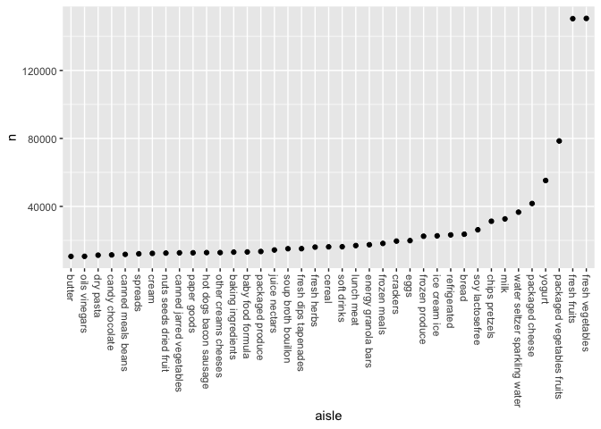

Homework3
================
Jialiang Hua
10/17/2021

``` r
library(tidyverse)
```

    ## ── Attaching packages ─────────────────────────────────────── tidyverse 1.3.1 ──

    ## ✓ ggplot2 3.3.5     ✓ purrr   0.3.4
    ## ✓ tibble  3.1.4     ✓ dplyr   1.0.7
    ## ✓ tidyr   1.1.3     ✓ stringr 1.4.0
    ## ✓ readr   2.0.1     ✓ forcats 0.5.1

    ## ── Conflicts ────────────────────────────────────────── tidyverse_conflicts() ──
    ## x dplyr::filter() masks stats::filter()
    ## x dplyr::lag()    masks stats::lag()

## Problem 1

Let’s load and describe the data!

``` r
library(p8105.datasets)
data("instacart")
```

The “instacart” dataset contains 1384617 rows and 15 columns.
Observations are items in orders by user. The dataset includes
order\_id, product\_id, add\_to\_cart\_order, reordered, user\_id,
eval\_set, order\_number, order\_dow, order\_hour\_of\_day,
days\_since\_prior\_order, product\_name, aisle\_id, department\_id,
aisle, department variables.

-   1.1 How many aisles are there, and which aisles are the most items
    ordered from?

``` r
aisle_df <- instacart %>% 
  count(aisle) %>% 
  arrange(desc(n))
```

There are 134 aisles and the most items ordered aisle is fresh
vegetables.

-   1.2 Make a plot that shows the number of items ordered in each
    aisle, limiting this to aisles with more than 10000 items ordered.
    Arrange aisles sensibly, and organize your plot so others can read
    it.

``` r
aisle_df %>% 
  filter(n > 10000) %>%
  mutate(
    aisle = factor(aisle),
    aisle = fct_reorder(aisle, n)
  ) %>% 
  ggplot(aes(x = aisle, y = n)) +
  theme(axis.text.x = element_text(angle = 270, vjust = 0.5, hjust = 1)) +
  geom_point()
```

<!-- -->
