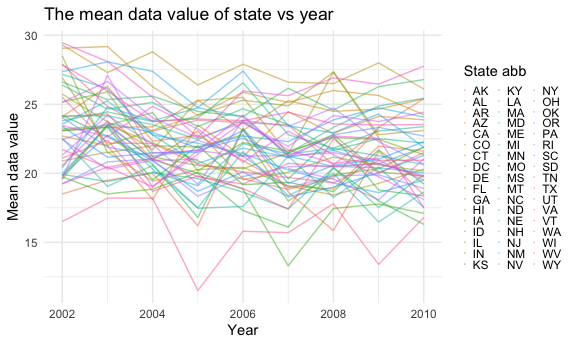

P8105\_Homework3
================
Jialiang Hua
10/17/2021

``` r
library(tidyverse)

knitr::opts_chunk$set(
  fig.width = 6,
  fig.asp = .6,
  out.width = "90%"
)

theme_set(theme_minimal())

options(
  ggplot2.continuous.colour = "viridis",
  ggplot2.continuous.fill = "viridis"
)

scale_color_discrete = scale_color_viridis_d
scale_fill_discrete = scale_fill_viridis_d
```

## Problem 1

**Let’s load and describe the data!**

``` r
library(p8105.datasets)
data("instacart")
```

The “instacart” dataset contains 1384617 rows and 15 columns. The
dataset includes order\_id, product\_id, add\_to\_cart\_order,
reordered, user\_id, eval\_set, order\_number, order\_dow,
order\_hour\_of\_day, days\_since\_prior\_order, product\_name,
aisle\_id, department\_id, aisle, department variables. Observations are
items in orders by user. Every user has an unique user id, and each
order has an unique order id. Every product was assigned a product id,
the aisle together with aisle id showed the category of product. Product
belonging to different department could be distinguished by department
id. Reorder indicated whether the product has been ordered before. Order
dow and order hour of day means at which hour in the weekday the product
was ordered.

**1.1 How many aisles are there, and which aisles are the most items
ordered from?**

``` r
aisle_df <- instacart %>% 
  count(aisle) %>% 
  arrange(desc(n))
```

There are 134 aisles and the most items ordered aisle is fresh
vegetables.

**1.2 Make a plot that shows the number of items ordered in each aisle,
limiting this to aisles with more than 10000 items ordered. Arrange
aisles sensibly, and organize your plot so others can read it.**

``` r
aisle_df %>% 
  filter(n > 10000) %>%
  mutate(
    aisle = factor(aisle),
    aisle = fct_reorder(aisle, n)
  ) %>% 
  ggplot(aes(x = aisle, y = n)) +
  theme(axis.text.x = element_text(angle = -90, vjust = 0.5, hjust = 0)) +
  geom_point()
```


There are 39 aisles having more than 1000 items sold. The plot is shown.

**1.3 Make a table showing the three most popular items in each of the
aisles “baking ingredients”, “dog food care”, and “packaged vegetables
fruits”. Include the number of times each item is ordered in your
table.**

``` r
instacart %>% 
  filter(aisle %in% c("baking ingredients", "dog food care", "packaged vegetables fruits")) %>%   group_by(aisle) %>% 
  count(product_name) %>% 
  mutate(
    rank = rank(desc(n))
  ) %>% 
  filter(rank < 4) %>% 
  arrange(aisle, rank) %>% 
  knitr::kable() #print the table
```

| aisle                      | product\_name                                 |    n | rank |
|:---------------------------|:----------------------------------------------|-----:|-----:|
| baking ingredients         | Light Brown Sugar                             |  499 |    1 |
| baking ingredients         | Pure Baking Soda                              |  387 |    2 |
| baking ingredients         | Cane Sugar                                    |  336 |    3 |
| dog food care              | Snack Sticks Chicken & Rice Recipe Dog Treats |   30 |    1 |
| dog food care              | Organix Chicken & Brown Rice Recipe           |   28 |    2 |
| dog food care              | Small Dog Biscuits                            |   26 |    3 |
| packaged vegetables fruits | Organic Baby Spinach                          | 9784 |    1 |
| packaged vegetables fruits | Organic Raspberries                           | 5546 |    2 |
| packaged vegetables fruits | Organic Blueberries                           | 4966 |    3 |

The top 3 popular items in baking ingredients are Light Brown Sugar,
Pure Baking Soda, Cane Sugar. The top 3 popular items in dog food care
are Snake Sticks Chicken & Rice Recipe Dog treats, Organix Chicken &
Brown Rice, Small Dog Biscuits. The top 3 popular items in packaged
vegetables fruits are Organic Baby Spinach, Organic Raspberries and
Organic Blueberries. According to table, we could found that the number
of the items are greatly different between aisles.

**1.4 Make a table showing the mean hour of the day at which Pink Lady
Apples and Coffee Ice Cream are ordered on each day of the week; format
this table for human readers (i.e. produce a 2 x 7 table).**

``` r
instacart %>% 
  filter(product_name %in% c("Pink Lady Apples", "Coffee Ice Cream")) %>%
  group_by(product_name, order_dow) %>% 
  summarize(mean_hour = mean(order_hour_of_day)) %>% 
  pivot_wider(
    names_from = "order_dow",
    values_from = "mean_hour"
  ) %>%
  knitr::kable() 
```

    ## `summarise()` has grouped output by 'product_name'. You can override using the `.groups` argument.

| product\_name    |        0 |        1 |        2 |        3 |        4 |        5 |        6 |
|:-----------------|---------:|---------:|---------:|---------:|---------:|---------:|---------:|
| Coffee Ice Cream | 13.77419 | 14.31579 | 15.38095 | 15.31818 | 15.21739 | 12.26316 | 13.83333 |
| Pink Lady Apples | 13.44118 | 11.36000 | 11.70213 | 14.25000 | 11.55172 | 12.78431 | 11.93750 |

The Table shows mean hour of the day at which Coffee Ice Cream and Pink
Lady Apples are ordered. I found that the time that Pink Lady Apples are
ordered fluctuate a little during the week while the Coffee Ice Cream
has a higher mean during the weekdays.

## Problem 2

**Lets load the data!**

``` r
library(p8105.datasets)
data("brfss_smart2010")
```

**Let’s do some data cleaning!**

``` r
brfss_clean <- brfss_smart2010 %>%
  janitor::clean_names() %>% 
  filter(
    topic == "Overall Health", 
    response %in% c("Excellent", "Very good", "Good", "Fair", "Poor")
  ) %>%
  mutate(
    response = factor(response),
    response = fct_relevel(response, c("Poor", "Fair", "Good", "Very good", "Excellent"))
  )
```

**2.1 In 2002, which states were observed at 7 or more locations? What
about in 2010?**

``` r
states_observed_2002 = brfss_clean %>% 
  filter(year == 2002) %>%
  select(c(1, 2, 3)) %>% 
  distinct() %>% 
  count(locationabbr) %>% 
  filter(n >= 7)

states_observed_2010 = brfss_clean %>% 
  filter(year == 2010) %>%
  select(c(1, 2, 3)) %>% 
  distinct() %>% 
  count(locationabbr) %>% 
  filter(n >= 7)

states_observed_2002
```

    ## # A tibble: 6 × 2
    ##   locationabbr     n
    ##   <chr>        <int>
    ## 1 CT               7
    ## 2 FL               7
    ## 3 MA               8
    ## 4 NC               7
    ## 5 NJ               8
    ## 6 PA              10

``` r
states_observed_2010
```

    ## # A tibble: 14 × 2
    ##    locationabbr     n
    ##    <chr>        <int>
    ##  1 CA              12
    ##  2 CO               7
    ##  3 FL              41
    ##  4 MA               9
    ##  5 MD              12
    ##  6 NC              12
    ##  7 NE              10
    ##  8 NJ              19
    ##  9 NY               9
    ## 10 OH               8
    ## 11 PA               7
    ## 12 SC               7
    ## 13 TX              16
    ## 14 WA              10

According to the result, **6** states **(CT FL MA NC NJ PA)** were
observed at 7 or more locations in 2002, while **14** states **(CA CO FL
MA MD NC NE NJ NY OH PA SC TX WA)** were observed at 7 or more locations
in 2010.

**2.2 Construct a dataset that is limited to Excellent responses, and
contains, year, state, and a variable that averages the data\_value
across locations within a state. Make a “spaghetti” plot of this average
value over time within a state (that is, make a plot showing a line for
each state across years – the geom\_line geometry and group aesthetic
will help).**

``` r
excell_df =
  brfss_clean %>% 
  filter(response == "Excellent") %>% 
  select(year, locationabbr, data_value) %>% 
  group_by(year, locationabbr) %>% 
  summarize(mean_data = mean(data_value))
```

    ## `summarise()` has grouped output by 'year'. You can override using the `.groups` argument.

``` r
excell_df %>% 
  group_by(locationabbr) %>% 
  ggplot(aes(x = year, y = mean_data, color = locationabbr)) +
  geom_line(alpha = 0.5) +
  labs(
    title = "The mean data value of state vs year",
    y = "Mean data value", 
    x = "Year",
  ) +
  scale_colour_hue("State abb") +
  theme(legend.key.size = unit(0.02,'cm')) +
  theme(legend.key.width = unit(0.05,'cm'))
```

    ## Warning: Removed 3 row(s) containing missing values (geom_path).



The spaghetti plot shows the fluctuate of data\_value together with
year. From the plot, it could find that, in 2005, there was a decrease
trend in data value, while it increased soon in the 2006. Most of the
value are between 20 and 25.

**2.3 Make a two-panel plot showing, for the years 2006, and 2010,
distribution of data\_value for responses (“Poor” to “Excellent”) among
locations in NY State.**

``` r
brfss_clean %>%
  filter(locationabbr == "NY", year %in% c(2006, 2010)) %>%
  ggplot(aes(x = data_value, color = as.character(year))) +
  geom_density() +
  facet_grid(. ~ year) + 
  labs(title = "Distribution of data value of responses for 2006 and 2010 in NY State",
       x = "Data value of responses",
       y = "Density of data value")
```


The density plot shows the distribution of data value.

## Problem 3

**Let’s load the data for problem 3!**

``` r
acc_df = read_csv("./data/accel_data.csv")
```

    ## Rows: 35 Columns: 1443

    ## ── Column specification ────────────────────────────────────────────────────────
    ## Delimiter: ","
    ## chr    (1): day
    ## dbl (1442): week, day_id, activity.1, activity.2, activity.3, activity.4, ac...

    ## 
    ## ℹ Use `spec()` to retrieve the full column specification for this data.
    ## ℹ Specify the column types or set `show_col_types = FALSE` to quiet this message.

**3.1 Load, tidy, and otherwise wrangle the data. Your final dataset
should include all originally observed variables and values; have useful
variable names; include a weekday vs weekend variable; and encode data
with reasonable variable classes. Describe the resulting dataset
(e.g. what variables exist, how many observations, etc).**

``` r
acc_clean = 
  acc_df %>% 
  pivot_longer(
    activity.1:activity.1440,
    names_to = "minute",
    names_prefix = "activity.",
    values_to = "activity_counts"
  ) %>% 
  mutate(
      weekday = case_when(
      day %in% c("Monday","Tuesday","Wednesday","Thursday","Friday") ~ "weekday",
      day %in% c("Saturday","Sunday") ~ "weekend")
  ) %>% 
  mutate(
    day = as.factor(day),
    day = fct_relevel(day, 
      "Monday", "Tuesday", "Wednesday", "Thursday", "Friday" , "Saturday", "Sunday"),
    weekday = as.factor(weekday),
    minute = as.numeric(minute)
  )
```

This dataset is has 50400 observations, 6 columns. It contains week,
day\_id, day, minute, activity\_counts, weekday variables.

**3.2 Traditional analyses of accelerometer data focus on the total
activity over the day. Using your tidied dataset, aggregate across
minutes to create a total activity variable for each day, and create a
table showing these totals. Are any trends apparent?**

``` r
acc_clean %>% 
  group_by(week, day) %>%
  summarize(total_activity = sum(activity_counts)) %>% 
  pivot_wider(
    names_from = day,
    values_from = total_activity
  ) %>% 
  knitr::kable()
```

    ## `summarise()` has grouped output by 'week'. You can override using the `.groups` argument.

| week |    Monday |  Tuesday | Wednesday | Thursday |   Friday | Saturday | Sunday |
|-----:|----------:|---------:|----------:|---------:|---------:|---------:|-------:|
|    1 |  78828.07 | 307094.2 |    340115 | 355923.6 | 480542.6 |   376254 | 631105 |
|    2 | 295431.00 | 423245.0 |    440962 | 474048.0 | 568839.0 |   607175 | 422018 |
|    3 | 685910.00 | 381507.0 |    468869 | 371230.0 | 467420.0 |   382928 | 467052 |
|    4 | 409450.00 | 319568.0 |    434460 | 340291.0 | 154049.0 |     1440 | 260617 |
|    5 | 389080.00 | 367824.0 |    445366 | 549658.0 | 620860.0 |     1440 | 138421 |

I find from the table that the total activity on weekend in lower than
the weekday.

**3.3 Accelerometer data allows the inspection activity over the course
of the day. Make a single-panel plot that shows the 24-hour activity
time courses for each day and use color to indicate day of the week.
Describe in words any patterns or conclusions you can make based on this
graph.**

``` r
acc_clean %>% 
  ggplot(aes(x = minute, y = activity_counts, color = day, group = day_id)) +
  geom_line(alpha = 0.6) + 
  labs(
    title = "24-Hour Activity Count by Day",
    x = "Time",
    y = "Activity Count"
  ) + 
  scale_x_continuous(
    breaks = c(0, 360, 720, 1080, 1440), 
    labels = c("12a.m.", "6a.m.", "12p.m.", "6p.m.", "11:59p.m."),
    limits = c(0, 1440)
  ) +
  viridis::scale_color_viridis(
    name = "Location",
    discrete = "TRUE")
```


I can find that the activity level of the patient was low during 12a.m.
to 6a.m.. There was a peak of activity around 12p.m. and 8p.m.
